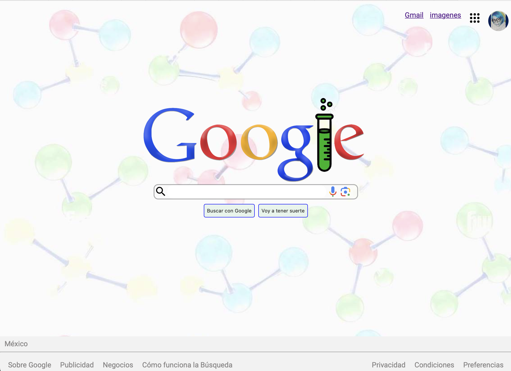

# Clon_de_Google
**Clon de Google** es un  proyecto realizado con la intención de aplicar los conocimientos obtenidos en el *BootCamp* de <u>Tecnolochicas Sabatino.</u>

Aquí utilizamos por primera vez:
* HTLM5
* CSS

***HTLM5:***  (HyperText Markup Language 5) es la última versión del lenguaje de marcado web estándar. Se utiliza para crear y estructurar contenido en línea, como páginas web, mediante etiquetas y elementos compatibles con multimedia y dispositivos modernos.

***CSS:*** (Cascading Style Sheets) es un lenguaje de diseño utilizado para estilizar el contenido HTML. Permite controlar la presentación, el diseño y el aspecto visual de los elementos de una página web.

